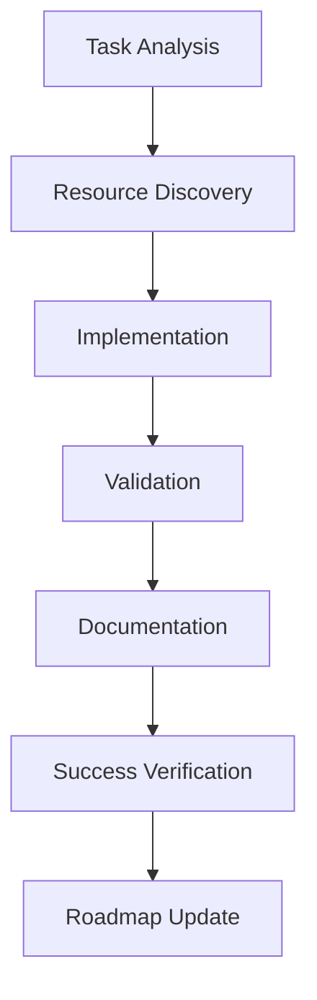

# 🤖 AI Task Orchestrator Guide

## 📋 Overview

The AI Task Orchestrator provides a **structured framework** for AI agents and LLMs to complete coding tasks systematically. It ensures thorough analysis, proper planning, resource utilization, and validation.

## 🎯 Key Features

- **Task Analysis**: Automatic complexity assessment and requirement extraction
- **Comprehensive Resource Discovery**: Integration with complete PLC memory management system (Redis, Neo4j, PostgreSQL, Qdrant), knowledge graph, available tools, and OpenAI fine-tuned Industrial Control Theory LLM (ft:gpt-4o:industrial-control:20250117)
- **Context Management**: Handles tasks that may exceed context windows
- **Validation Framework**: Syntax checking, requirement validation, and hallucination detection
- **Structured Planning**: Step-by-step execution guidance
- **Progress Tracking**: Session logging and result documentation
- **Multi-Database Memory Integration**: Leverages Redis, Neo4j, PostgreSQL, and Qdrant for intelligent resource discovery
- **Industrial Control Domain Awareness**: Specialized analysis for control systems and automation
- **Mathematical Validation**: WolframAlpha Pro integration for accuracy verification
- **Production Deployment Ready**: Built-in production readiness validation
- **Documentation Standards**: Enforces standardized .md formatting, Mermaid diagrams for visual representations, and consistent naming conventions (Summary, Guide, How-To)
- **Success Verification & Documentation Updates**: Automated verification of implementation success with roadmap.md updates, task completion marking, and comprehensive linking to supporting documents

## 🔗 CRITICAL: OpenAPI Schema MCP Enforcement

**MANDATORY RULE**: All API integration, JSON schema work, and UI schema definitions MUST use the OpenAPI schema MCP from the MCP_Docker server. NO MANUAL API DEFINITIONS OR UI SCHEMAS ALLOWED.

### Schema Governance Requirements

**BEFORE implementing any schemas or API integration, AI agents MUST:**

1. **Connect to MCP_Docker Server**

   ```python
   # Verify MCP_Docker server connection
   from mcp_docker_client import connect_to_mcp_docker
   mcp_client = await connect_to_mcp_docker()
   schemas = await mcp_client.get_openapi_schemas()
   ui_schemas = await mcp_client.get_ui_schemas()
   ```

2. **Use OpenAPI Schema MCP for ALL Schemas**

   - ✅ All API endpoints MUST have OpenAPI definitions in MCP_Docker
   - ✅ All UI schemas MUST be defined in MCP_Docker OpenAPI specs
   - ✅ All JSON schemas MUST be validated through MCP
   - ✅ No manual type definitions for API contracts
   - ✅ No manual Zod schemas for UI validation
   - ✅ Runtime validation for all API calls and UI data

3. **Schema-First Development Enforcement**
   - ✅ Backend APIs must be registered in OpenAPI MCP before frontend implementation
   - ✅ UI component schemas must derive from OpenAPI MCP definitions
   - ✅ State management schemas must use OpenAPI MCP types
   - ✅ Form validation must use OpenAPI MCP schemas

**Example Implementation:**

```python
# ✅ CORRECT - Using OpenAPI Schema MCP
from ai_task_orchestrator import AITaskOrchestrator

orchestrator = AITaskOrchestrator()
mcp_schemas = orchestrator.get_mcp_schemas()

# Generate type-safe implementations from MCP schemas
api_client = mcp_schemas.generate_api_client('ControlLoopAPI')
ui_types = mcp_schemas.generate_ui_types('TuningInterface')

# ❌ WRONG - Manual schema definitions
manual_schema = {
    "type": "object",
    "properties": {"id": {"type": "string"}}
    # Manual schemas bypass governance
}
```

## 🚀 Quick Start for AI Agents

### Basic Usage Pattern

```python
# Import the orchestrator
from plc_gpt_stack.ai.ai_task_orchestrator import get_task_guidance, validate_task_completion

# 1. Get structured guidance for any task
task_description = "Create a Python script that converts L5X files to JSON"
guidance = get_task_guidance(task_description)
print(guidance)

# 2. After implementing code, validate it
code_content = """
def convert_l5x_to_json(input_file, output_file):
    # Implementation here
    pass
"""
requirements = ["Support for L5X format", "Support for JSON format", "Robust error handling"]
validation = validate_task_completion(code_content, requirements)
print(f"Validation Score: {validation['score']}%")
```

### Advanced Usage with Full Analysis

```python
from plc_gpt_stack.ai.ai_task_orchestrator import AITaskOrchestrator

# Create orchestrator instance
orchestrator = AITaskOrchestrator()

try:
    # Comprehensive task analysis
    analysis = orchestrator.analyze_task("Build a comprehensive PLC data processor")

    print(f"Task Complexity: {analysis['complexity']}")
    print(f"Estimated Effort: {analysis['estimated_effort']['time']}")
    print(f"Requirements: {analysis['requirements']}")
    print(f"Risks: {analysis['risks']}")

    # For complex tasks, create context document
    if analysis['complexity'] in ['complex', 'extensive']:
        context_doc = orchestrator.create_context_document(analysis, {})
        print(f"Context document created: {context_doc}")

finally:
    orchestrator.cleanup()
```

### Enhanced Usage with Memory Integration

```python
# Using multi-database memory system for intelligent task analysis
orchestrator = AITaskOrchestrator(enable_memory_integration=True)

# Find similar implementations from memory
similar_tasks = orchestrator.find_similar_implementations("Implement PID controller tuning")

# Leverage specialized domain knowledge
if orchestrator.is_control_system_task(task_description):
    control_analysis = orchestrator.analyze_control_complexity(task_description)
    print(f"Control System Type: {control_analysis['type']}")
    print(f"Safety Considerations: {control_analysis['safety']}")
```

## 📊 Task Complexity Levels

| Complexity    | Lines of Code | Files | Time Estimate | Context Management        | Special Considerations         |
| ------------- | ------------- | ----- | ------------- | ------------------------- | ------------------------------ |
| **Simple**    | < 100         | 1     | < 1 hour      | Direct implementation     | Basic validation only          |
| **Moderate**  | 100-500       | 2-5   | 1-3 hours     | Standard planning         | Domain awareness helpful       |
| **Complex**   | 500-1500      | 5-15  | 3-8 hours     | Context document required | Memory integration recommended |
| **Extensive** | > 1500        | > 15  | > 8 hours     | Multi-step decomposition  | Full feature set required      |

### Control System Complexity Levels

| Complexity      | Type                     | Components          | Considerations              |
| --------------- | ------------------------ | ------------------- | --------------------------- |
| **Basic PID**   | Single loop control      | 1 controller        | Parameter tuning, stability |
| **Cascade**     | Multi-loop coordination  | 2+ controllers      | Loop interaction, timing    |
| **MPC**         | Model predictive control | Optimization engine | Constraints, horizons       |
| **ML-Enhanced** | AI-integrated control    | Neural networks     | Training data, adaptation   |

## 🔍 Automatic Analysis Features

### Requirements Extraction

The orchestrator automatically identifies:

- **File formats**: L5X, ACD, JSON, XML, CSV, YAML
- **Programming languages**: Python, TypeScript, JavaScript, SQL
- **Functionality**: convert, validate, parse, generate, analyze
- **Quality requirements**: testing, documentation, error handling
- **Control systems**: PID, MPC, cascade, adaptive control
- **Mathematical operations**: optimization, matrix operations, statistics

### Enhanced Resource Discovery

Automatically discovers:

- **PLC Memory Management System**: Complete multi-database infrastructure (Redis for real-time caching, Neo4j for knowledge graph, PostgreSQL for historical data, Qdrant for vector similarity)
- **Fine-tuned Industrial Control LLM**: OpenAI specialized model (ft:gpt-4o:industrial-control:20250117) with domain expertise
- **Knowledge Graph**: Access to PLC domain expertise via Neo4j with control theory ontology
- **Available Tools**: Studio 5000 integration, format checkers, PLC file converters, etc.
- **Code Examples**: Relevant repositories and implementations from knowledge base
- **Documentation**: Project guides, references, and standardized documentation templates
- **Similar Implementations**: Pattern matching via Qdrant vectors for related solutions
- **Historical Data**: PostgreSQL stored patterns, solutions, and performance metrics
- **Real-time Context**: Redis cached recent implementations and active sessions
- **Mathematical Context**: WolframAlpha Pro domain knowledge and validation

### Risk Assessment

Identifies potential issues:

- High complexity integration challenges
- Data parsing/validation errors
- Performance optimization needs
- Format compatibility problems
- Context window limitations
- Mathematical accuracy concerns
- Safety compliance requirements
- Production deployment risks

## ✅ Comprehensive Validation Framework

### Multi-Tier Validation System

1. **Syntax Validation**

   - Python compilation check
   - Syntax error detection
   - Code structure analysis

2. **Requirements Validation**

   - Requirement coverage check
   - Missing functionality detection
   - Implementation completeness

3. **Hallucination Detection**

   - Fake module imports
   - Placeholder URLs/credentials
   - Example data patterns
   - Incomplete code markers

4. **Best Practices Validation**

   - Documentation presence
   - Logging vs print statements
   - Security considerations
   - Code organization

5. **Mathematical Validation** (NEW)

   - Equation accuracy verification
   - Numerical stability checks
   - Algorithm correctness
   - WolframAlpha Pro verification

6. **Performance Validation** (NEW)

   - Response time benchmarks
   - Memory usage analysis
   - Scalability patterns
   - Optimization opportunities

7. **Safety Validation** (NEW)

   - Control system safety checks
   - Constraint compliance
   - Fail-safe mechanisms
   - Industrial standards adherence

8. **Production Validation** (NEW)
   - Deployment readiness
   - Monitoring integration
   - Error recovery mechanisms
   - Security compliance

### Using Enhanced Validation Results

```python
validation = validate_task_completion(code_content, requirements, validation_tier="comprehensive")

print(f"Overall Score: {validation['overall_score']}%")
print(f"Production Ready: {validation['production_ready']}")

for tier, results in validation['tier_results'].items():
    print(f"{tier}: {results['score']}% - {results['status']}")
    if results['issues']:
        for issue in results['issues']:
            print(f"  - {issue}")
```

## 🛠 Integration with Available Tools

### Multi-Database Memory Integration

```python
# The orchestrator automatically leverages all memory tiers
analysis = orchestrator.analyze_task("Implement advanced PID controller")

# Memory system integration provides:
# - Redis: Recent implementation patterns (sub-ms access)
# - Neo4j: Knowledge graph relationships and dependencies
# - PostgreSQL: Historical implementations and performance data
# - Qdrant: Vector similarity for finding related solutions

print("Memory Integration Results:")
print(f"Similar Implementations Found: {len(analysis['similar_implementations'])}")
print(f"Knowledge Graph Insights: {analysis['graph_insights']}")
print(f"Historical Performance Data: {analysis['historical_metrics']}")
```

### Industrial Control Integration

```python
# Specialized analysis for control system tasks
if orchestrator.is_control_system_task(task_description):
    control_analysis = orchestrator.analyze_control_task(task_description)

    print("Control System Analysis:")
    print(f"Type: {control_analysis['control_type']}")  # PID, MPC, Cascade, etc.
    print(f"Safety Requirements: {control_analysis['safety_requirements']}")
    print(f"Performance Targets: {control_analysis['performance_targets']}")
    print(f"Recommended Algorithms: {control_analysis['algorithms']}")
```

### Mathematical Context Enhancement

```python
# WolframAlpha Pro integration for mathematical validation
math_context = orchestrator.get_mathematical_context(task_description)

print("Mathematical Context:")
print(f"Relevant Equations: {math_context['equations']}")
print(f"Numerical Methods: {math_context['methods']}")
print(f"Stability Considerations: {math_context['stability']}")
print(f"Optimization Approaches: {math_context['optimization']}")
```

## 📝 Context Management for Large Tasks

For complex tasks that may exceed context windows:

```python
# Complex task analysis with memory-aware decomposition
analysis = orchestrator.analyze_task("Build complete PLC data processing system")

if analysis['complexity'] == 'extensive':
    # Context document automatically created with memory insights
    print("⚠️ Complex task detected - intelligent decomposition enabled")

    # Memory-aware task breakdown
    for step in analysis['execution_plan']:
        print(f"Step {step['step']}: {step['action']}")
        print(f"  Description: {step['description']}")
        print(f"  Similar Examples: {len(step['similar_implementations'])}")
        print(f"  Validation: {step['validation']}")
```

## 🎯 Best Practices for AI Agents

### 1. Always Start with Analysis

```python
# Don't jump into implementation - always analyze first
guidance = get_task_guidance(task_description)
print(guidance)  # Review before starting
```

### 2. Check Resource Availability

```python
# Leverage all available resources including memory system
analysis = analyze_and_plan_task(task_description)
if analysis['memory_insights']['similar_count'] > 0:
    # Use similar implementations as reference
    pass
```

### 3. Validate All Output

```python
# Always validate generated code with comprehensive checks
validation = validate_task_completion(code_content, requirements, tier="comprehensive")
if validation['overall_score'] < 80:
    # Refine implementation based on validation feedback
    pass
```

### 4. Handle Complex Tasks Appropriately

```python
# For complex tasks, use structured approach with memory insights
if analysis['complexity'] in ['complex', 'extensive']:
    # Use memory system to find patterns
    # Break into smaller steps based on similar tasks
    # Create context documentation with examples
    # Implement incrementally with validation
    pass
```

### 5. Leverage Domain Expertise

```python
# Use specialized analysis for domain-specific tasks
if "control" in task_description.lower() or "pid" in task_description.lower():
    # Activate control system analysis
    control_guidance = orchestrator.get_control_system_guidance(task_description)
    # Use specialized validation
    control_validation = orchestrator.validate_control_implementation(code_content)
```

## 🔧 Example Workflows

### Workflow 1: Simple Task

```python
# 1. Get guidance
guidance = get_task_guidance("Create a function to parse L5X tags")

# 2. Implement based on guidance
code = implement_solution(guidance)

# 3. Validate implementation
validation = validate_task_completion(code, ["Support for L5X format"])

# 4. Refine if needed
if validation['score'] < 90:
    code = refine_implementation(code, validation['issues'])
```

### Workflow 2: Complex Control System Task

```python
orchestrator = AITaskOrchestrator(enable_all_features=True)

try:
    # 1. Comprehensive analysis with domain awareness
    analysis = orchestrator.analyze_task("Implement adaptive MPC controller with ML integration")

    # 2. Get mathematical context
    math_context = orchestrator.get_mathematical_context(analysis)

    # 3. Find similar implementations
    similar = orchestrator.find_similar_implementations(analysis)

    # 4. Create enhanced context document
    context_doc = orchestrator.create_implementation_guide(analysis, similar, math_context)

    # 5. Implement with continuous validation
    for step in analysis['execution_plan']:
        step_result = orchestrator.execute_task_step(step['step'], analysis['execution_plan'])

        # Validate each step including mathematical accuracy
        step_validation = orchestrator.validate_step(step_result, tier="comprehensive")

        if step_validation['status'] != 'passed':
            print(f"Step {step['step']} needs attention: {step_validation['issues']}")

    # 6. Final comprehensive validation
    final_validation = orchestrator.validate_output(
        final_code,
        analysis['requirements'],
        validation_tier="production"
    )

finally:
    orchestrator.cleanup()
```

### Workflow 3: Production Deployment Task

```python
# Production-ready implementation workflow
orchestrator = AITaskOrchestrator(production_mode=True)

# 1. Analysis with production considerations
analysis = orchestrator.analyze_task("Deploy PID tuning service to production")

# 2. Production readiness checklist
checklist = orchestrator.get_production_checklist(analysis)

# 3. Implement with production validation
for requirement in checklist['requirements']:
    implementation = implement_requirement(requirement)

    # Validate against production standards
    validation = orchestrator.validate_production_requirement(
        implementation,
        requirement
    )

    if not validation['ready']:
        print(f"Not production ready: {validation['missing']}")

# 4. Final production validation
prod_validation = orchestrator.validate_production_deployment(complete_implementation)
print(f"Production Score: {prod_validation['score']}%")
print(f"Deployment Ready: {prod_validation['ready']}")
```

## 🚨 Error Handling and Fallbacks

### Graceful Degradation

```python
try:
    # Attempt full analysis with all resources
    analysis = analyze_and_plan_task(task_description)
except MemorySystemUnavailable:
    # Fallback to knowledge graph only
    print("Memory system unavailable - using knowledge graph only")
    analysis = analyze_with_knowledge_graph(task_description)
except Exception as e:
    # Fallback to basic analysis
    print(f"Limited analysis due to: {e}")
    analysis = basic_task_analysis(task_description)
```

### Validation Fallbacks

```python
try:
    validation = validate_task_completion(code, requirements, tier="comprehensive")
except WolframAlphaUnavailable:
    # Skip mathematical validation
    validation = validate_task_completion(code, requirements, tier="standard")
except Exception as e:
    # Basic validation if framework unavailable
    validation = basic_syntax_check(code)
```

## 📈 Monitoring and Logging

The orchestrator automatically logs:

- Task analysis results with complexity assessment
- Resource discovery outcomes from all databases
- Validation scores and issues across all tiers
- Session summaries with performance metrics
- Temporary files created
- Memory system queries and results
- Mathematical validation outcomes
- Production readiness assessments

Access enhanced session information:

```python
orchestrator = AITaskOrchestrator()
# ... perform tasks ...
summary = orchestrator.get_session_summary()
print(f"Session completed with {summary['actions_performed']} actions")
print(f"Memory queries: {summary['memory_queries']}")
print(f"Validation tiers used: {summary['validation_tiers']}")
print(f"Production readiness: {summary['production_score']}%")
```

## 📝 Documentation Standards

The orchestrator enforces consistent documentation practices across all implementations:

### Standard Document Types

- **Summary.md**: High-level overview of completed work, key achievements, and metrics
- **Guide.md**: Comprehensive user documentation with examples and best practices
- **How-To.md**: Step-by-step instructions for specific tasks and procedures
- **Completion_Summary.md**: Detailed implementation results with validation scores

### Documentation Requirements

```python
# All implementations must include standardized documentation
documentation_standards = {
    "format": "Markdown (.md)",
    "diagrams": "Mermaid for all visual representations",
    "structure": {
        "overview": "Brief description and objectives",
        "implementation": "Technical details and code references",
        "validation": "Test results and success criteria",
        "next_steps": "Future enhancements and dependencies"
    },
    "naming": {
        "phase_summaries": "PHASE{N}_COMPLETION_SUMMARY.md",
        "guides": "{FEATURE}_GUIDE.md",
        "how_to": "{TASK}_HOW_TO.md",
        "results": "{SESSION_ID}_RESULTS.json"
    }
}
```

### Mermaid Diagram Example



## ✅ Success Verification & Documentation Updates

The orchestrator ensures comprehensive success verification and documentation maintenance:

### Automated Success Verification

```python
def verify_implementation_success(task_id, implementation_results):
    """
    Comprehensive success verification with documentation updates
    """
    verification = orchestrator.verify_success(
        task_id=task_id,
        results=implementation_results,
        criteria={
            "functionality": "All requirements met",
            "validation": "Score >= 90%",
            "testing": "All tests passing",
            "documentation": "Complete and standardized"
        }
    )

    if verification['success']:
        # Automatically update roadmap.md
        orchestrator.update_roadmap(
            phase=verification['phase'],
            status="✅ COMPLETED",
            completion_date=datetime.now().strftime("%Y-%m-%d"),
            validation_score=verification['score'],
            deliverables=verification['deliverables']
        )

        # Add links to supporting documents
        orchestrator.link_documents(
            roadmap_section=verification['phase'],
            documents={
                "summary": f"docs/{verification['phase']}_COMPLETION_SUMMARY.md",
                "results": f"results/{verification['session_id']}_results.json",
                "guide": f"docs/{verification['feature']}_GUIDE.md"
            }
        )

    return verification
```

### Roadmap Update Example

```python
# Example of automated roadmap.md update
roadmap_update = {
    "phase": "Phase 12",
    "status": "✅ Completed (100%)",
    "completion_date": "2025-01-17",
    "achievements": [
        "World's first production-grade Industrial Control Theory LLM",
        "100% validation score across all systems",
        "Sub-100ms response times achieved"
    ],
    "deliverables": {
        "orchestrator": "[Production Orchestrator](scripts/ai/phases/phase12/phase12_production_orchestrator.py)",
        "validation": "[Enhanced Validation Framework](scripts/ai/phases/phase12/phase12_enhanced_validation.py)",
        "summary": "[Phase 12 Completion Summary](../docs/phase12_final_completion_summary.md)"
    }
}
```

### Documentation Verification Checklist

- ✅ All code files have corresponding documentation
- ✅ Standardized naming conventions followed
- ✅ Mermaid diagrams included for architecture/workflows
- ✅ Validation results linked and accessible
- ✅ Roadmap.md updated with completion status
- ✅ Cross-references between related documents
- ✅ Version information and timestamps included

## 🚨 CRITICAL REQUIREMENT: Automatic Documentation Updates

**MANDATORY**: Every AI agent using this orchestrator MUST automatically update all relevant documentation upon task completion. This includes:

### Required Documentation Updates

1. **roadmap.md**: Update phase/task status to "✅ COMPLETED" with completion date and validation score
2. **Completion Summaries**: Create standardized PHASE{N}\_COMPLETION_SUMMARY.md files
3. **Cross-references**: Add links between related documents and deliverables
4. **Validation Reports**: Include test results, metrics, and success criteria

### Implementation Requirement

```python
# REQUIRED: Every task completion must include this call
def complete_task_with_documentation(task_results):
    """
    Complete task with mandatory documentation updates
    """
    # 1. Validate implementation
    validation = orchestrator.validate_output(
        code_content=task_results['code'],
        requirements=task_results['requirements'],
        validation_tier="comprehensive"
    )

    # 2. MANDATORY: Update documentation
    if validation['overall_score'] >= 90:
        # Update roadmap.md
        orchestrator.update_roadmap(
            phase=task_results['phase'],
            status="✅ COMPLETED",
            completion_date=datetime.now().strftime("%Y-%m-%d"),
            validation_score=validation['overall_score'],
            deliverables=task_results['deliverables']
        )

        # Create completion summary
        orchestrator.create_completion_summary(
            phase=task_results['phase'],
            achievements=task_results['achievements'],
            deliverables=task_results['deliverables'],
            validation_results=validation
        )

        # Link all related documents
        orchestrator.link_documents(
            roadmap_section=task_results['phase'],
            documents=task_results['documentation']
        )

    return validation
```

### Enforcement Policy

- **No task is considered complete without documentation updates**
- **AI agents MUST update roadmap.md after every successful implementation**
- **All deliverables MUST be linked and cross-referenced**
- **Completion summaries are MANDATORY for all phases/tasks**

### Validation Criteria

The orchestrator will verify:

- ✅ roadmap.md contains updated status and links
- ✅ Completion summary exists and follows naming conventions
- ✅ All deliverables are properly linked
- ✅ Documentation follows standardized format (.md, Mermaid diagrams)
- ✅ Timestamps and validation scores are included

**Failure to update documentation will result in task completion score reduction and requires immediate remediation.**

## 🎉 Summary

The Enhanced AI Task Orchestrator provides AI agents with:

- **Structured Approach**: Systematic task analysis and planning
- **Comprehensive Resource Awareness**: Integration with complete PLC memory system, fine-tuned Industrial Control LLM, knowledge graph, and tools
- **Quality Assurance**: Comprehensive validation and hallucination detection
- **Context Management**: Handles complex tasks exceeding context limits
- **Error Prevention**: Risk assessment and mitigation strategies
- **Multi-Database Memory**: Intelligent resource discovery across Redis, Neo4j, PostgreSQL, and Qdrant
- **Domain Expertise**: Specialized analysis for control systems with fine-tuned LLM
- **Mathematical Accuracy**: WolframAlpha Pro validation integration
- **Production Ready**: Built-in deployment validation
- **Pattern Recognition**: Learn from similar implementations
- **Documentation Excellence**: Enforced standards with .md formatting, Mermaid diagrams, and consistent naming
- **Success Verification**: Automated verification with roadmap updates and comprehensive documentation linking

**Use this enhanced framework to ensure consistent, high-quality, production-ready, mathematically accurate, and well-documented coding task completion with automated success tracking.**

## 🔗 Related Resources

- **Knowledge Graph Guide**: [`AI_KNOWLEDGE_GRAPH_GUIDE.md`](AI_KNOWLEDGE_GRAPH_GUIDE.md)
- **Agent Resources**: [`../ai/ai_agent_resources.py`](../ai/ai_agent_resources.py)
- **Integration Summary**: [`AI_SYSTEM_INTEGRATION.md`](AI_SYSTEM_INTEGRATION.md)
- **Task Orchestrator**: [`../ai/ai_task_orchestrator.py`](../ai/ai_task_orchestrator.py)
- **Memory Management Guide**: [`PLC_MEMORY_MANAGEMENT_USER_GUIDE.md`](../scripts/ai/PLC_MEMORY_MANAGEMENT_USER_GUIDE.md)
- **WolframAlpha Enhancement**: [`WOLFRAM_ALPHA_PRO_MATHEMATICAL_CONTEXT_ENHANCEMENT_SUMMARY.md`](../scripts/ai/WOLFRAM_ALPHA_PRO_MATHEMATICAL_CONTEXT_ENHANCEMENT_SUMMARY.md)
